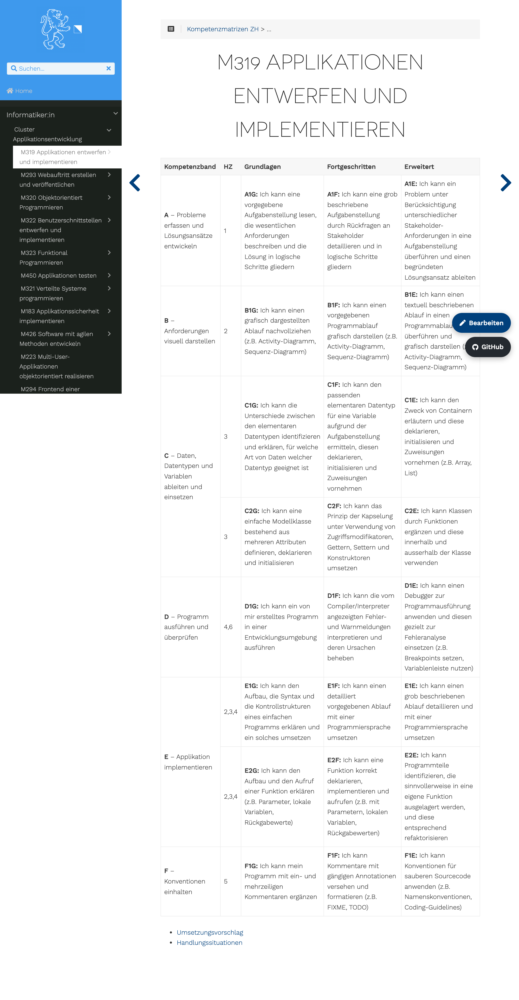
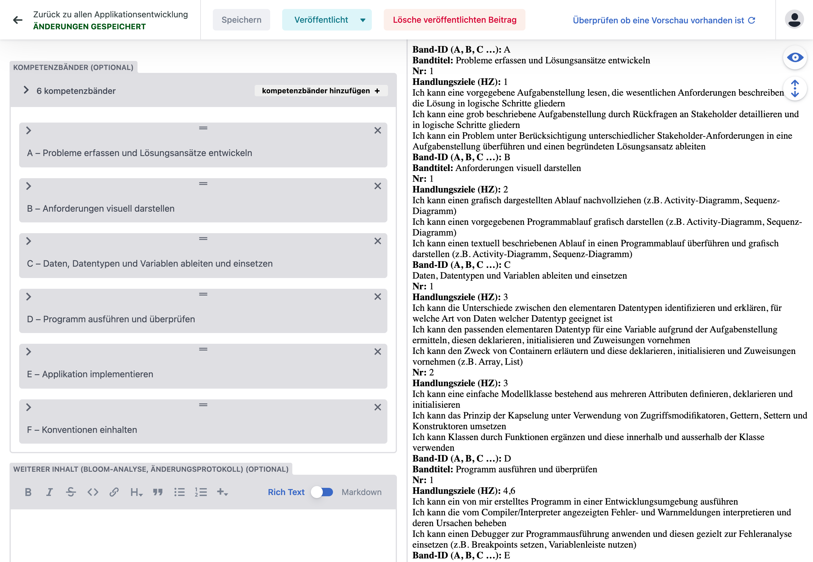
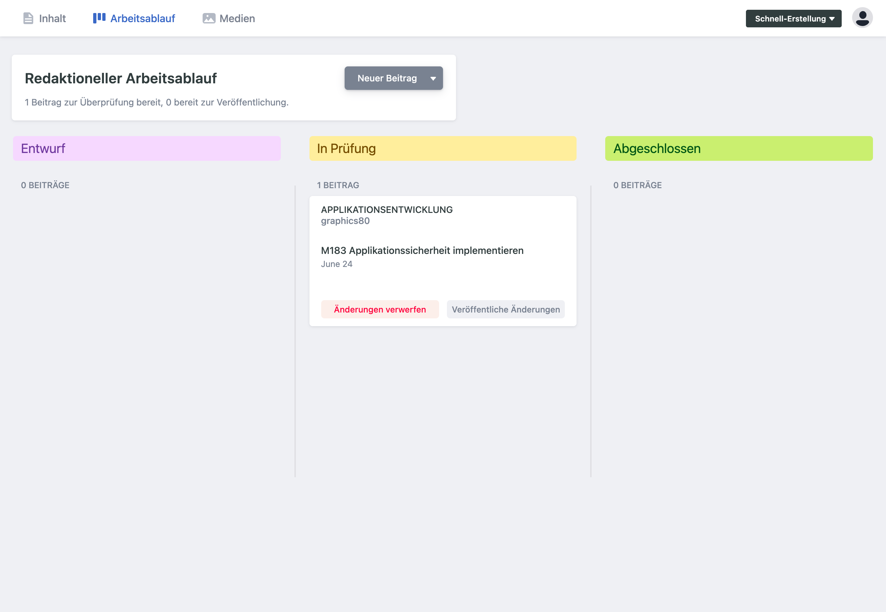
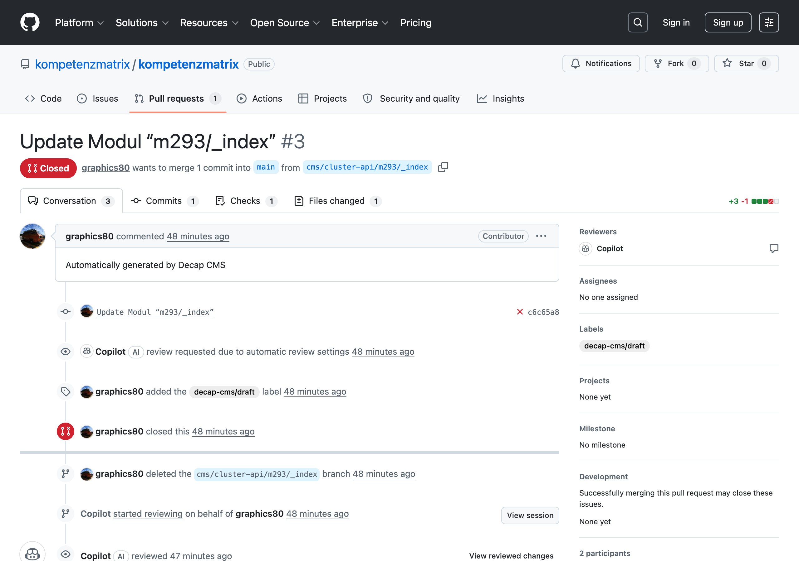

# Eine Kompetenzmatrix bearbeiten — der Flow

Wie eine Änderung an einer Matrix von der Bearbeitung bis auf
[kompetenzmatrix.ch](https://kompetenzmatrix.ch) gelangt — Schritt für Schritt, mit dem Modul
**M319 – Applikationen entwerfen und implementieren** als durchgehendem Beispiel. Kurzfassung
in [CONTRIBUTING.md](../CONTRIBUTING.md), Inhaltsregeln dort unter „Inhaltsregeln (EHB)".

## Überblick

```
                Bearbeiten                  Prüfen (CI)            Publizieren
  ┌──────────────────────────────┐   ┌──────────────────┐   ┌──────────────────┐
  │ A) Web-Editor /admin/        │   │ validate.yml     │   │ deploy.yml       │
  │    Decap CMS → Fork → PR     │──▶│  - validate_     │   │  push auf main:  │
  │ B) Git: Branch → _index.md   │   │    modules.py    │──▶│  hugo --minify   │
  │    → PR                      │   │  - hugo --minify │   │  rsync → it.bzz  │
  └──────────────────────────────┘   └──────────────────┘   └──────────────────┘
        Pull Request                  Review + Merge auf main      Live in ~1 Min
```

Single Source of Truth ist dieses Repo. Server/Website werden **nie von Hand** bearbeitet —
jede Änderung läuft über einen Pull Request auf `main`. Zwei Rollen:

| Rolle           | Wer             | Rechte                                      | Tut                       |
|-----------------|-----------------|---------------------------------------------|---------------------------|
| **Autor:in**    | z.B. Lehrperson | nur GitHub-Account, **keine** Schreibrechte | bearbeitet, öffnet PR     |
| **Reviewer:in** | Repo-Team       | Schreibrechte auf `main`                    | prüft Inhalt + CI, merged |

## Was wird bearbeitet?

Jede Matrix ist eine Datei — M319 z.B. `content/informatiker/cluster-api/m319/_index.md`:

```
content/<cluster>/<modul>/_index.md
```

Frontmatter (YAML) hält die Daten, gerendert wird die Tabelle automatisch
(`layouts/partials/matrix.html`, Zell-IDs wie `A1G` werden berechnet):

```yaml
---
title: M319 Applikationen entwerfen und implementieren
modul: m319
cluster: cluster-api
date: "2025-07-02T10:05:10Z"   # immer gequotet (s. „Fallstricke")
draft: false
kompetenzbaender:
  - id: A                       # Grossbuchstabe(n)
    titel: Probleme erfassen und Lösungsansätze entwickeln
    kompetenzen:
      - nr: 1
        hz: "1"                 # Handlungsziel(e), z.B. "1,2"
        grundlagen: Ich kann …  # alle drei Stufen müssen mit „Ich kann" starten
        fortgeschritten: Ich kann …
        erweitert: Ich kann …
---
```

ÜK-Module ohne Matrix: `uek: true` setzen → keine Matrix-Pflicht.

---

## Teil 1 — Autor:in: Änderung erfassen

Es gibt zwei Wege: den **Web-Editor** (empfohlen für Lehrpersonen) oder **direkt via Git**.

### Weg A — Web-Editor `/admin/`

Nur ein GitHub-Account nötig, keine Schreibrechte aufs Repo. Konfiguriert mit
`open_authoring: true` + `publish_mode: editorial_workflow` (`static/admin/config.yml`).

#### Schritt 1 · Modul aufrufen

Die Matrix von M319 liegt unter
[kompetenzmatrix.ch/informatiker/cluster-api/m319/](https://kompetenzmatrix.ch/informatiker/cluster-api/m319/).
Oben rechts führt **Bearbeiten** direkt in den Web-Editor für dieses Modul.



#### Schritt 2 · Im Web-Editor anmelden

Der Editor `/admin/` (Decap CMS) verlangt einmalig **Mit GitHub einloggen** — ein normaler
GitHub-Account genügt, keine Freischaltung. Beim ersten Mal wird das Repo automatisch in den
eigenen Account **geforkt**.


#### Schritt 3 · Band / Kompetenz ändern

Cluster **Applikationsentwicklung → M319** wählen. Die Kompetenzbänder (A, B, C …) und ihre
Kompetenzen erscheinen als Formular — keine Tabellen-Syntax. Text einer Gütestufe
(Grundlagen / Fortgeschritten / Erweitert) anpassen oder eine Kompetenz ergänzen. Regeln
greifen schon im Formular: jeder Stufentext **muss mit „Ich kann" beginnen**, Band-IDs sind
Grossbuchstaben. Keine neuen Bänder erfinden — bestehende ergänzen/korrigieren.



#### Schritt 4 · Speichern → Pull Request entsteht

**Speichern** committet auf einen Branch `cms/cluster-api/m319/_index` im eigenen Fork und
öffnet **sofort einen Pull Request** gegen `main`. Status zuerst **Entwurf**. Der PR existiert
ab dem ersten Speichern.

Das Editorial-Board (`/admin/`, Reiter *Arbeitsablauf*) hat drei Spalten. Jede Karte = ein
offener PR; die Spalte spiegelt sich als GitHub-**Label** (Prefix `decap-cms/`):

| Board-Spalte | GitHub-Label                | Bedeutung                   | PR offen? |
|--------------|-----------------------------|-----------------------------|-----------|
| Entwurf      | `decap-cms/draft`           | gespeichert, noch in Arbeit | ja        |
| In Prüfung   | `decap-cms/pending_review`  | bereit zum Review           | ja        |
| Abgeschlossen | `decap-cms/pending_publish` | reviewt, wartet auf Merge  | ja        |



- Karte nach rechts ziehen → Label wechselt (der Editor setzt es per API auf dem PR).
- **„Veröffentliche Änderungen"** im Editor würde den PR mergen — geht aber nur mit
  Schreibrechten. Bei Open Authoring **merged das Team** direkt auf GitHub (Teil 2). Nach dem
  Merge verschwindet die Karte. **„Änderungen verwerfen"** schliesst den PR ohne Merge.

Damit endet die Autor:innen-Arbeit: **gemerged wird nicht selbst** (Fork hat keine Schreibrechte auf `main`).

### Weg B — direkt im Git (für Git-erfahrene)

```bash
git clone --recurse-submodules <repo-url>
cd kompetenzmatrix
git checkout -b fix/m319-band-b
# content/informatiker/cluster-api/m319/_index.md bearbeiten
python scripts/validate_modules.py     # lokal prüfen, bevor PR
hugo server                            # http://localhost:1313 — Vorschau
git commit -am "fix(content): …" && git push -u origin fix/m319-band-b
gh pr create
```

Tipp: Taste `.` im GitHub-Repo öffnet github.dev (Browser-Editor) ohne lokales Setup.

---

## Teil 2 — Reviewer:in: prüfen und freigeben

### Schritt 5 · Pull Request öffnen

Die Änderung erscheint als PR im Hauptrepo. Beispiel-PR (hier M293, gleiche Mechanik):



Sichtbar: Autor:in (Contributor), Quell-Branch `cms/...`, Label `decap-cms/draft`, der
automatische Copilot-Review und die Checks.

### Schritt 6 · CI prüfen

`main` ist **branch-protected**: der Check **`validate`** muss grün sein, sonst ist der
Merge-Button gesperrt. `validate.yml` läuft auf jeden PR:

1. **`scripts/validate_modules.py`** — EHB-Regeln (Exit ≠ 0 bricht den Check):
   - Nicht-ÜK-Modul braucht ≥ 1 Kompetenzband; jedes Band `id` (Grossbuchstaben), `titel`, ≥ 1 Kompetenz.
   - Jede Kompetenz `nr` (int), `hz`, alle drei Stufen; jeder Stufentext startet mit „Ich kann".
2. **`hugo --minify`** — fängt Build-/Template-Brüche ab.

Rot → Reviewer:in kommentiert, Autor:in bessert im selben PR nach (neuer Commit, Check läuft neu).

### Schritt 7 · Inhalt reviewen

Fachlich gegen die EHB-Regeln prüfen (Schweizer Hochdeutsch, in sich geschlossene Gütestufen,
aktiv/beobachtbar, produktneutral). Details in
[CONTRIBUTING.md](../CONTRIBUTING.md#inhaltsregeln-ehb).

### Schritt 8 · Mergen → live

CI grün + Review ok → **Merge** nach `main`. Der Push triggert `deploy.yml`:

```
hugo --minify  →  rsync -az --delete --exclude=cms-oauth/  public/  →  root@it.bzz.ch
```

`concurrency: deploy-prod` verhindert überlappende Deploys → die Änderung an M319 ist in
~1 Minute auf [kompetenzmatrix.ch](https://kompetenzmatrix.ch) live.

> ⚠️ `enforce_admins` ist aus: Org-Admins können das CI-Gate umgehen (auch via
> CMS-„Veröffentlichen"). Fremde via Fork können ohnehin nicht mergen. Disziplin: erst mergen,
> wenn `validate` grün ist.

---

## Fallstricke

- **`date` immer quoten** (`date: "…Z"`). Unquoted parst Decaps js-yaml als YAML-Timestamp,
  re-serialisiert beim Speichern via `toISOString()` als `.000Z` → unnötiger Churn im Diff.
- **Keine neuen Kompetenzbänder erfinden** — bestehende ergänzen/korrigieren (EHB-Vorgabe).
- **Server nie von Hand anfassen** — `cms-oauth/` ist per `rsync --exclude` vor Deploys
  geschützt, alles andere unter `public/` wird bei jedem Deploy mit `--delete` überschrieben.

## Screenshots aktualisieren

Die Bilder in `img/` sind mit Playwright erzeugt. Öffentliche Seiten (`m319-live`,
`admin-login`, `pr-review`) lassen sich headless neu aufnehmen; die eingeloggten Screens
(`m319-editor`, `board`) brauchen ein headed Chromium mit manuellem GitHub-Login. Bei
UI-Änderungen am CMS neu aufnehmen und gleiche Dateinamen behalten.
